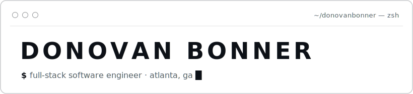
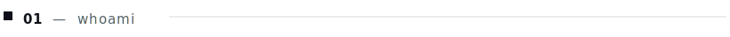
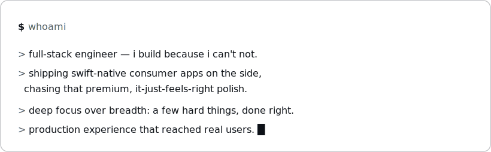
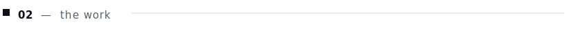
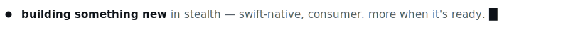
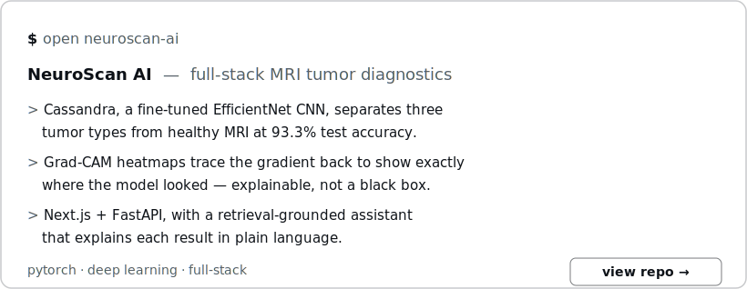
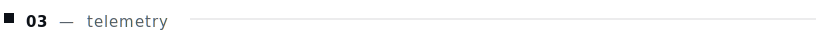
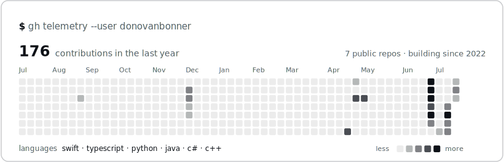
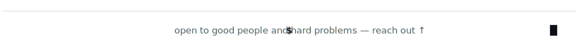

<picture><source media="(prefers-color-scheme: dark)" srcset="assets/dark/header.svg"/></picture>

<a href="https://linkedin.com/in/donovanbonner1"><picture><source media="(prefers-color-scheme: dark)" srcset="https://img.shields.io/badge/LINKEDIN-0d1117?style=flat-square&logo=linkedin&logoColor=ffffff"/></picture></a>
<a href="https://x.com/donovanbonnerr"><picture><source media="(prefers-color-scheme: dark)" srcset="https://img.shields.io/badge/X-0d1117?style=flat-square&logo=x&logoColor=ffffff"/></picture></a>
<a href="mailto:donovanbonner11@gmail.com"><picture><source media="(prefers-color-scheme: dark)" srcset="https://img.shields.io/badge/EMAIL-0d1117?style=flat-square&logo=gmail&logoColor=ffffff"/></picture></a>

<picture><source media="(prefers-color-scheme: dark)" srcset="assets/dark/s01.svg"/></picture>
<picture><source media="(prefers-color-scheme: dark)" srcset="assets/dark/whoami.svg"/></picture>

<picture><source media="(prefers-color-scheme: dark)" srcset="assets/dark/s02.svg"/></picture>
<picture><source media="(prefers-color-scheme: dark)" srcset="assets/dark/building.svg"/></picture>
<a href="https://github.com/donovanbonner/cassandra-brain-tumor-classifier"><picture><source media="(prefers-color-scheme: dark)" srcset="assets/dark/work.svg"/></picture></a>

<picture><source media="(prefers-color-scheme: dark)" srcset="assets/dark/s03.svg"/></picture>

<picture><source media="(prefers-color-scheme: dark)" srcset="assets/dark/contribs.svg"/></picture>

<picture><source media="(prefers-color-scheme: dark)" srcset="assets/dark/footer.svg"/></picture>

<!-- one responsive picture per visual; light/dark handled via prefers-color-scheme -->
